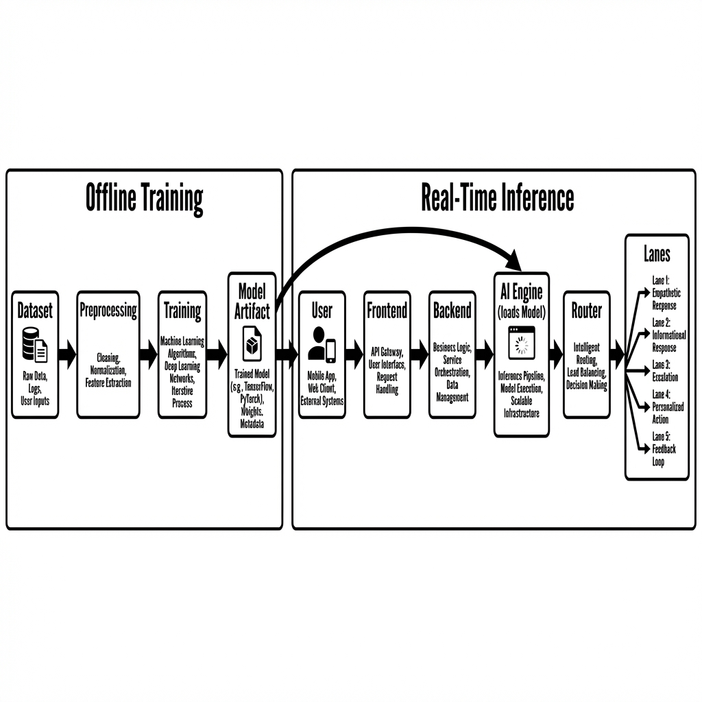

# 🛡️ EmpathicGateway

**AI-Powered Priority Routing & PII Detection System**

EmpathicGateway is an intelligent traffic management system designed for high-load customer support environments. It classifies incoming requests using **BERT** (Critical/High/Normal), detects sensitive data (PII) using **NER**, and routes traffic accordingly to prevent system overload.



---

## 🌟 Key Features

### 🧠 Intelligent Core
- **Hybrid AI Engine**: Combines `SentenceTransformers` (BERT) for feature extraction with `LogisticRegression` for ultra-fast intent classification.
- **Priority Routing**: Automatically routes excessive load to "Slow Lanes" while keeping "Fast Lanes" open for critical issues (e.g., "Fraud Detected").
- **Long Text Support**: Handles complex queries up to **2048 characters**.

### 🛡️ Security & Guardrails
- **PII Masking**: Automatically detects and redacts Credit Cards, Emails, and Names using regex + `dslim/bert-base-NER`.
- **Injection Defense**: Heuristic checks to prevent Prompt Injection attacks.
- **API Security**: Token-based authentication (`X-API-Key`).

### 📊 Real-Time Operations
- **Live Dashboard**: Streamlit interface with sub-second update capabilities ("Dynamic Sleep").
- **Stress Testing**: Built-in "Chaos Mode" to simulate traffic spikes.
- **Explainable AI**: Provides confidence scores and reasoning for routing decisions.

---

## 📂 Project Structure

A clean, minimalist repository focused on production readiness:

```
EmpathicGateway/
├── backend/               # FastAPI Application
│   ├── main.py            # API Gateway & Logic
│   ├── models.py          # Data Structures
│   ├── train_model.py     # ML Training Script
│   └── urgency_model.joblib.dvc # AI Model (Tracked by DVC)
├── frontend/              # Streamlit Dashboard
│   └── app.py             # UI Logic
├── scripts/               # Deployment Utility Scripts
├── docs/                  # Documentation
│   └── TECHNICAL_REPORT.md
└── docker-compose.yml     # Container Definitions
```

---

## 🚀 Quick Start

### Option 1: Docker (Recommended)

The easiest way to run the full stack. The system is containerized and ready to launch.

```bash
# 1. Start Services
docker-compose up --build
```

**Access:**
- 🎨 **Frontend (Dashboard):** http://localhost:8503
- ⚙️ **Backend (API):** http://localhost:8081/docs

*Note: On the first run, the system will automatically download the AI model (~90MB) from Hugging Face.*

### Option 2: Local Python Dev

If you prefer running without Docker:

```bash
# 1. Install dependencies
pip install -r requirements.txt

# 2. Start Backend
uvicorn backend.main:app --port 8081 --host 0.0.0.0

# 3. Start Frontend (New Terminal)
streamlit run frontend/app.py --server.port 8503
```

---

## 📊 Tech Stack

- **AI/ML:** PyTorch, SentenceTransformers (MiniLM-L6), Scikit-Learn (LogReg), HuggingFace Transformers.
- **Backend:** FastAPI, Uvicorn.
- **Frontend:** Streamlit, Altair Charts.
- **Infrastructure:** Docker, DVC (Data Version Control).

---

## 📜 License

MIT License.
