# EmpathicGateway - Architecture Diagrams

## 1. System Architecture

```mermaid
graph TB
    subgraph "Client Layer"
        User[👤 User]
    end
    
    subgraph "Frontend Layer"
        UI[🖥️ Streamlit Dashboard<br/>Port 8503]
        UI_Features[📊 Features:<br/>- Live Chat<br/>- Traffic Inspector<br/>- Analytics<br/>- Security Audit]
    end
    
    subgraph "Backend Layer"
        API[⚡ FastAPI Server<br/>Port 8080]
        API_Features[🔧 Components:<br/>- Request Validation<br/>- Lane Management<br/>- Response Generation]
    end
    
    subgraph "AI/ML Layer"
        PII[🛡️ PII Detection]
        BERT[🤖 BERT Classifier]
        NER[🏷️ NER Model]
        
        PII_Regex[Regex Engine<br/>Email, Card, Phone, ID]
        PII_NER[NER Engine<br/>Person, Location, Org]
        
        BERT_Model[MiniLM-L6-v2<br/>+ LogisticRegression]
        NER_Model[dslim/bert-base-NER]
    end
    
    subgraph "Routing Layer"
        Router[🚦 Lane Router]
        Fast[⚡ Fast Lane<br/>Limit: 10]
        Normal[🐢 Normal Lane<br/>Limit: 2]
    end
    
    User -->|HTTP Request| UI
    UI -->|POST /chat| API
    API -->|1. Detect PII| PII
    PII --> PII_Regex
    PII --> PII_NER
    PII_NER --> NER_Model
    API -->|2. Classify Intent| BERT
    BERT --> BERT_Model
    API -->|3. Route Request| Router
    Router -->|Priority 1-2| Fast
    Router -->|Priority 3| Normal
    Fast -->|Response| API
    Normal -->|Response| API
    API -->|JSON Response| UI
    UI -->|Display| User
    
    style User fill:#e1f5ff,stroke:#01579b,stroke-width:3px
    style UI fill:#c8e6c9,stroke:#2e7d32,stroke-width:2px
    style API fill:#fff9c4,stroke:#f57f17,stroke-width:2px
    style PII fill:#ffccbc,stroke:#d84315,stroke-width:2px
    style BERT fill:#e1bee7,stroke:#6a1b9a,stroke-width:2px
    style NER fill:#e1bee7,stroke:#6a1b9a,stroke-width:2px
    style Router fill:#ffe0b2,stroke:#e65100,stroke-width:2px
    style Fast fill:#a5d6a7,stroke:#2e7d32,stroke-width:2px
    style Normal fill:#ffab91,stroke:#d84315,stroke-width:2px
```

## 2. Data Flow Diagram

```mermaid
sequenceDiagram
    participant U as 👤 User
    participant F as 🖥️ Frontend
    participant B as ⚡ Backend
    participant P as 🛡️ PII Detection
    participant N as 🏷️ NER Model
    participant M as 🤖 BERT Model
    participant R as 🚦 Router
    
    U->>F: Submit Request<br/>"My card 4532-1234-5678-9012 was stolen!"
    F->>B: POST /chat
    
    Note over B: Step 1: PII Detection
    B->>P: Analyze Text
    P->>P: Regex Check<br/>✓ Credit Card Found
    P->>N: NER Analysis
    N-->>P: No Entities
    P-->>B: Masked: "My card [CREDIT_CARD] was stolen!"<br/>PII Types: ["CREDIT_CARD"]
    
    Note over B: Step 2: Intent Classification
    B->>M: Classify Intent
    M-->>B: Intent: payment_issue<br/>Confidence: 0.99<br/>Priority: 1 (CRITICAL)
    
    Note over B: Step 3: Lane Routing
    B->>R: Route Request (Priority: 1)
    R->>R: Check Fast Lane<br/>Capacity: 7/10 ✓
    R-->>B: Assigned to Fast Lane
    
    Note over B: Step 4: Generate Response
    B-->>F: {<br/>  ticket_id: "abc123",<br/>  priority: 1,<br/>  label: "CRITICAL",<br/>  pii_detected: true,<br/>  pii_types: ["CREDIT_CARD"],<br/>  intent: "payment_issue"<br/>}
    F-->>U: Display Response
```

## 3. Deployment Architecture (Google Cloud Run)

```mermaid
graph LR
    subgraph "Development"
        Dev[👨‍💻 Developer]
        Git[📦 GitHub<br/>mmapce/empathicgateway]
    end
    
    subgraph "CI/CD Pipeline"
        Trigger[🔔 Cloud Build Trigger]
        Build[🔨 Build Step<br/>Docker Build]
        Push[📤 Push Step<br/>Container Registry]
        Deploy[🚀 Deploy Step<br/>gcloud run deploy]
    end
    
    subgraph "Google Cloud Platform"
        Registry[📦 Container Registry<br/>europe-west1]
        
        subgraph "Cloud Run Services"
            Backend[⚡ empathic-backend<br/>Memory: 2GB, CPU: 2<br/>Min: 0, Max: 10]
            Frontend[🖥️ empathic-frontend<br/>Memory: 1GB, CPU: 1<br/>Min: 0, Max: 5]
        end
    end
    
    subgraph "End Users"
        Users[🌍 Public Internet]
    end
    
    Dev -->|git push| Git
    Git -->|webhook| Trigger
    Trigger --> Build
    Build --> Push
    Push --> Registry
    Registry --> Deploy
    Deploy --> Backend
    Deploy --> Frontend
    Frontend -.->|API Calls| Backend
    Users -->|HTTPS| Frontend
    
    style Dev fill:#e3f2fd,stroke:#1976d2,stroke-width:2px
    style Git fill:#f5f5f5,stroke:#424242,stroke-width:2px
    style Trigger fill:#fff9c4,stroke:#f57f17,stroke-width:2px
    style Build fill:#fff9c4,stroke:#f57f17,stroke-width:2px
    style Push fill:#fff9c4,stroke:#f57f17,stroke-width:2px
    style Deploy fill:#fff9c4,stroke:#f57f17,stroke-width:2px
    style Registry fill:#e1bee7,stroke:#6a1b9a,stroke-width:2px
    style Backend fill:#bbdefb,stroke:#1976d2,stroke-width:3px
    style Frontend fill:#c8e6c9,stroke:#2e7d32,stroke-width:3px
    style Users fill:#ffccbc,stroke:#d84315,stroke-width:2px
```

## 4. ML Model Architecture

```mermaid
graph TB
    subgraph "Intent Classification Pipeline"
        Input1[📝 User Text]
        Embed[🔤 BERT Embeddings<br/>sentence-transformers/all-MiniLM-L6-v2<br/>Output: 384-dim vector]
        Classifier[🎯 Logistic Regression<br/>77 Classes<br/>Accuracy: 99%+]
        Output1[📊 Intent + Confidence + Priority]
        
        Input1 --> Embed
        Embed --> Classifier
        Classifier --> Output1
    end
    
    subgraph "PII Detection Pipeline"
        Input2[📝 User Text]
        
        subgraph "Regex Branch"
            Regex[🔍 Regex Patterns]
            RegexOut[Email, Card, Phone, ID]
        end
        
        subgraph "NER Branch"
            NER[🏷️ BERT NER<br/>dslim/bert-base-NER]
            NEROut[Person, Location, Org]
        end
        
        Merge[🔀 Merge Results]
        Mask[🎭 Apply Masking]
        Output2[🛡️ Masked Text + PII Types]
        
        Input2 --> Regex
        Input2 --> NER
        Regex --> RegexOut
        NER --> NEROut
        RegexOut --> Merge
        NEROut --> Merge
        Merge --> Mask
        Mask --> Output2
    end
    
    style Input1 fill:#e3f2fd,stroke:#1976d2,stroke-width:2px
    style Input2 fill:#e3f2fd,stroke:#1976d2,stroke-width:2px
    style Embed fill:#e1bee7,stroke:#6a1b9a,stroke-width:2px
    style Classifier fill:#e1bee7,stroke:#6a1b9a,stroke-width:2px
    style NER fill:#e1bee7,stroke:#6a1b9a,stroke-width:2px
    style Regex fill:#ffccbc,stroke:#d84315,stroke-width:2px
    style Mask fill:#c8e6c9,stroke:#2e7d32,stroke-width:2px
    style Output1 fill:#fff9c4,stroke:#f57f17,stroke-width:2px
    style Output2 fill:#fff9c4,stroke:#f57f17,stroke-width:2px
```

## 5. Priority Routing Logic

```mermaid
flowchart TD
    Start([📥 Incoming Request]) --> PII{🛡️ PII<br/>Detected?}
    PII -->|Yes| Mask[🎭 Mask PII]
    PII -->|No| Intent
    Mask --> Intent[🤖 Classify Intent]
    
    Intent --> Priority{📊 Determine<br/>Priority}
    
    Priority -->|payment_issue<br/>get_refund<br/>fraud_report<br/>complaint| P1[🔴 Priority 1<br/>CRITICAL]
    Priority -->|cancel_order<br/>change_order<br/>track_order| P2[🟡 Priority 2<br/>HIGH]
    Priority -->|Other Intents| P3[🟢 Priority 3<br/>NORMAL]
    
    P1 --> FastCheck{⚡ Fast Lane<br/>Available?}
    P2 --> FastCheck
    P3 --> NormalCheck{🐢 Normal Lane<br/>Available?}
    
    FastCheck -->|Yes<br/>< 10 active| FastLane[⚡ Fast Lane<br/>Process Request]
    FastCheck -->|No<br/>>= 10 active| Error429[❌ HTTP 429<br/>Too Many Requests]
    
    NormalCheck -->|Yes<br/>< 2 active| NormalLane[🐢 Normal Lane<br/>Process Request]
    NormalCheck -->|No<br/>>= 2 active| Error429
    
    FastLane --> Response[✅ Generate Response]
    NormalLane --> Response
    Response --> End([📤 Return to User])
    Error429 --> End
    
    style Start fill:#e3f2fd,stroke:#1976d2,stroke-width:3px
    style P1 fill:#ffcdd2,stroke:#c62828,stroke-width:3px
    style P2 fill:#fff9c4,stroke:#f57f17,stroke-width:3px
    style P3 fill:#c8e6c9,stroke:#2e7d32,stroke-width:3px
    style FastLane fill:#a5d6a7,stroke:#2e7d32,stroke-width:2px
    style NormalLane fill:#ffab91,stroke:#d84315,stroke-width:2px
    style Error429 fill:#ef9a9a,stroke:#c62828,stroke-width:2px
    style Response fill:#bbdefb,stroke:#1976d2,stroke-width:2px
    style End fill:#e3f2fd,stroke:#1976d2,stroke-width:3px
```

---

## How to Use These Diagrams

### Option 1: View in Markdown Editors
- **VS Code**: Install "Markdown Preview Mermaid Support" extension
- **GitHub**: Automatically renders Mermaid diagrams
- **Obsidian**: Native Mermaid support

### Option 2: Export as Images
1. Go to https://mermaid.live/
2. Paste the Mermaid code
3. Click "Download PNG/SVG"

### Option 3: Include in Documentation
- Copy-paste into README.md
- GitHub will render automatically
- Perfect for project documentation

---

**Created:** January 4, 2026  
**Project:** EmpathicGateway  
**Format:** Mermaid Diagrams
